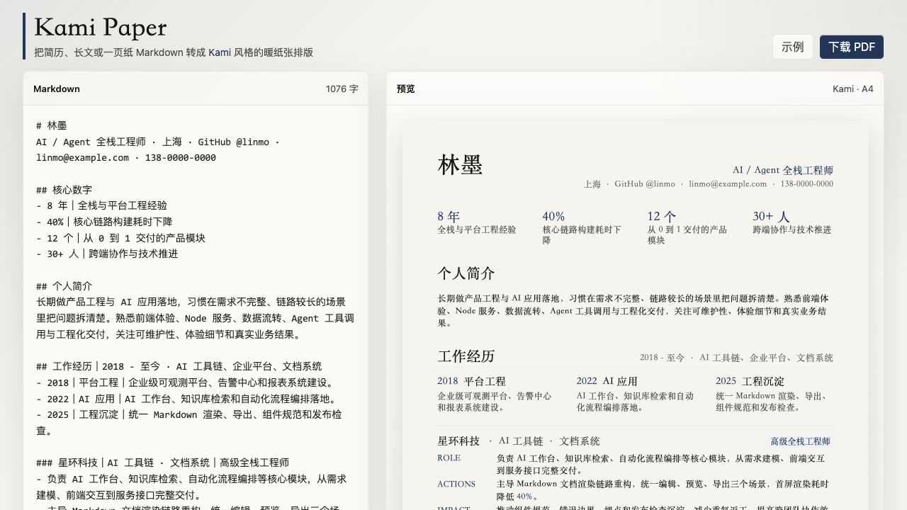

# kami-paper

[English](docs/README.en.md)

一个纯静态的 Markdown 排版工具，可将简历、长文或一页纸内容转换为受 [Kami](https://github.com/tw93/kami) 启发的 A4 文档版式。

适合需要快速生成精致文档，但不想搭建复杂文档工具链的场景。



### 特性

- Markdown 实时编辑和预览
- Kami 风格的暖纸张排版
- 适合简历的核心数字、时间线、项目三段式结构
- 浏览器本地导出 PDF
- 无构建步骤、无后端、无需账号

### 使用

直接在浏览器打开 `index.html`，或用任意静态服务启动当前目录。

```bash
python3 -m http.server 4174
```

然后访问：

```text
http://127.0.0.1:4174
```

### Markdown 格式

以姓名和联系信息开始：

```markdown
# 你的名字
AI / Agent 工程师 · 上海 · GitHub @name · email@example.com
```

使用 `## 核心数字` 生成指标区：

```markdown
## 核心数字
- 8 年｜工程经验
- 40%｜构建耗时下降
- 12 个｜交付项目
- 30+ 人｜跨团队协作
```

使用 `###` 生成经历或项目块：

```markdown
### 项目名称｜产品方向 · 技术方向｜角色定位
- 角色说明
- 关键动作
- 量化结果
```

### 致谢

文档视觉风格参考 [tw93/kami](https://github.com/tw93/kami)。

PDF 导出使用本地副本：

- [html2canvas](https://github.com/niklasvh/html2canvas)
- [jsPDF](https://github.com/parallax/jsPDF)

### 许可

MIT
